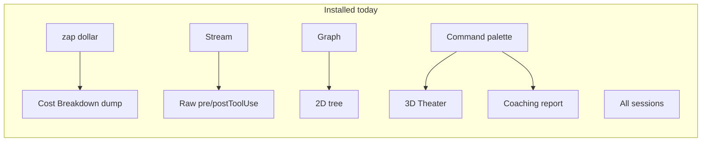
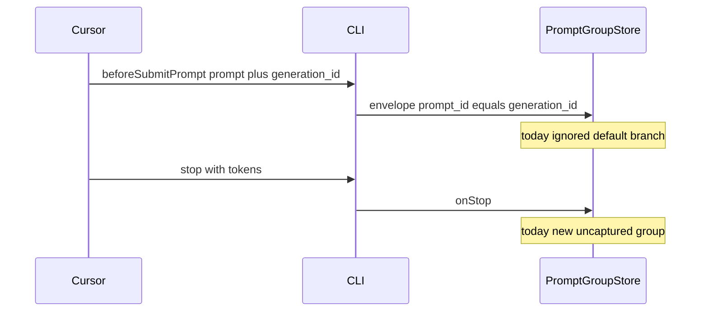
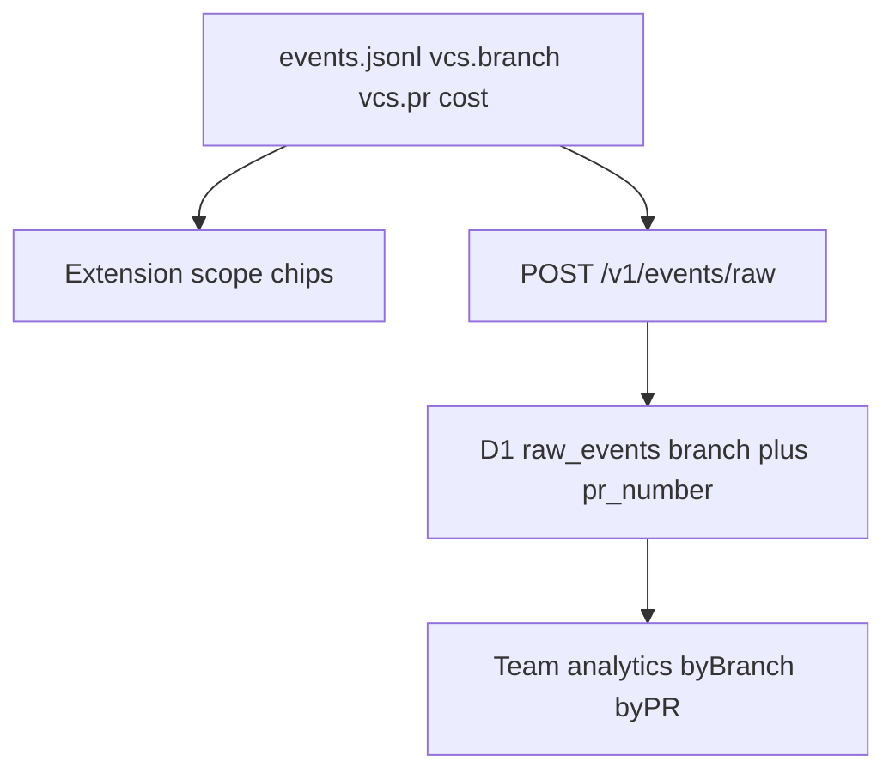

# Simplify PromptConduit: cost per prompt, branch, and PR

## Why the installed experience feels unlike the VSX listing

The [Open VSX gallery](https://open-vsx.org/extension/promptconduit/promptconduit) leads with **Orchestration Theater** (command palette only). A fresh install instead gets **four always-on status-bar buttons** (zap, Stream, All sessions, Graph) and a cost panel that dumps ledger + what-if + by-model + tips + edge cases + raw JSON at once.

The thunderbolt/`$` item *is* created on activate in [`editor-extension/src/extension.ts`](editor-extension/src/extension.ts) and [`statusBar.ts`](editor-extension/src/statusBar.ts). It only hides when `promptconduit.cost.enabled` is false. It is easy to miss among Cursor’s own status items, and clicking it opens the dense Cost Breakdown rather than a focused “this prompt cost X” view.

The rich marketing zero-state in [`landing.ts`](editor-extension/src/landing.ts) is **preview-only**. Live empty state is a stub in [`webview/costPanel/render.ts`](editor-extension/webview/costPanel/render.ts).

**Product home after this work:** one status-bar item → one panel whose default story is *what this prompt / this branch / this PR cost, and one way to do better*. Stream, Graph, Theater, and raw JSON stay as “nerd” exits.

---

## Phase 1 — Capture Cursor prompts (the “(uncaptured turn)” bug)

This is a grouping bug, not a missing hook. Cursor already sends `prompt` + `generation_id` on `beforeSubmitPrompt`. The CLI already lifts `generation_id` → `prompt_id`. [`PromptGroupStore`](editor-extension/src/promptGroup.ts) only opens a turn on Claude’s `UserPromptSubmit`, so Cursor `stop` costs land in intentional `uncaptured` groups.

**editor-extension** ([`src/promptGroup.ts`](editor-extension/src/promptGroup.ts)):

- Treat `beforeSubmitPrompt` like `UserPromptSubmit` (`onPrompt`). `onPrompt` already reads `env.raw.prompt`.
- Leave `stop` as the closer; do **not** also `onStop` `afterAgentResponse` in v1 (risk of double groups). Add a test that a Cursor `beforeSubmitPrompt` → `stop` pair produces `kind: "prompt"` with text and attached cost.
- Rewrite [`promptGroup.test.ts`](editor-extension/test/unit/promptGroup.test.ts) cases that currently document “uncaptured is Cursor’s normal path”.
- Keep the uncaptured fallback for genuine orphans (cost with no submit).

**cli** (small, same PR cycle if possible): extend [`promptEnricher.Applies`](cli/internal/enrich/prompt.go) to `beforeSubmitPrompt` so interrupt/char stats match Claude. No envelope schema change.

Prompt text stays **local** (events.jsonl / extension UI). Cloud phase below aggregates **cost by git context**, not prompt bodies.

---

## Phase 2 — One home surface: cost per prompt + one suggestion

Stay inside the existing cost webview ([`webview/costPanel/render.ts`](editor-extension/webview/costPanel/render.ts), [`src/costPanel/styles.ts`](editor-extension/src/costPanel/styles.ts)). Keep `--vscode-*` theme tokens so it still looks like the editor, not a second product.

**Status bar:** collapse four items to **one** `$(zap) $request · $session` that runs `promptconduit.cost.showDetails`. Stream / Graph / All sessions remain **commands** plus links from the panel footer (“Activity log”, “Session graph”). Optional later: a `$(ellipsis)` overflow item if we miss the one-click Stream users already have.

**Default Cost panel (session scope):**

1. **Hero** — this session’s API-equivalent cost (existing copy, less chrome: drop session-id code in the hero).
2. **Scope chips** — Session (default) | This branch | This PR (Phase 3 fills the last two; chips can be disabled until data exists).
3. **Cost per prompt** — the ledger is the page. Collapsed row: `$` + prompt excerpt + relative bar. Expanded: model, tokens, cache hit — **not** what-if, **not** raw JSON.
4. **Do better** — promote the single highest-signal tip from existing `tipsHtml` / coaching derive (cache, model tier, interrupt). Full Agent Coaching stays a command.
5. **Nerd drawer** (closed): What-if comparison, by-model table, Worth knowing, Learn more, **Raw events**, link to Stream.

Stream itself ([`src/streamFeed.ts`](editor-extension/src/streamFeed.ts)): collapse `preToolUse`/`postToolUse` pairs into one “tool” row so the feed is readable when someone does open it. No new panel.

**Zero-state:** use a shortened `landingHtml()` in the live panel (privacy + “hooks installed → this fills in”) so first install matches the listing’s promise, without the 3D theater as the first thing they see.

**Tests:** update [`test/unit/costPanel.test.ts`](editor-extension/test/unit/costPanel.test.ts) for default-collapsed nerd sections and Cursor prompt excerpts. Refresh `npm run preview` + screenshots so VSX no longer leads with Theater.

---

## Phase 3 — Local cost per branch (feature) and per PR

You chose **git branch = feature**. Data is already on local envelopes (`enrichments.vcs.branch`, optional `enrichments.vcs.pr`). There is **no** feature entity today.

**Aggregation** (new helper next to [`promptGroup.ts`](editor-extension/src/promptGroup.ts) / [`state.ts`](editor-extension/src/state.ts)):

- Sum `enrichments.cost` for the workspace repo.
- **This branch** = current `git branch --show-current` (CLI vcs already has it on events). Display label: strip a `feat/` / `fix/` / `chore/` prefix for the chip (`feat/simplify-cost` → `simplify-cost`), keep the full ref in the tooltip.
- **This PR** = `vcs.pr.number` when the `gh` cache is warm; else hide/disable the chip and show “PR unknown until `gh` sees an open PR on this branch”.
- Attribute a cost event to branch/PR from the envelope on that event (not “whatever HEAD is now”), so history stays correct after checkout.

**UI:** the same ledger, filtered/rolled-up by scope. Hero kicker becomes “This branch would cost” / “PR #N would cost”. Status-bar tooltip can add `branch $X · PR #N $Y`.

No platform change required for this phase. Ship as editor-extension **0.21**.

---

## Phase 4 — Cloud for teams (separate platform PR)

Local JSONL already has branch + PR. D1 does **not** persist PR: [`envelopeNormalize.ts`](platform/app/api/src/services/envelopeNormalize.ts) resolves `pr_number` but ingest only writes `repo_name` / `branch`. Team cost API ([`teamAnalytics.ts`](platform/app/api/src/handlers/teamAnalytics.ts)) rolls up `byRepo` only. GitHub webhook comments already post **branch** spend as a PR proxy.

- Migration: `raw_events.pr_number` (nullable integer + index with `repo_name`).
- Lift `pr_number` at ingest from `enrichments.vcs.pr`.
- Extend `GET /v1/organizations/:orgId/analytics/cost` with `byBranch` and `byPR` (same period filters).
- Team UI ([`TeamPage.jsx`](platform/app/web/src/pages/TeamPage.jsx)): table “spend by branch (feature)” and “spend by PR”, not only by repo.
- Personal `GET /v1/me/analytics/cost`: optional `byBranch` so a signed-in user sees the same rollup across machines.

Do **not** add prompt text columns. Teams value is attribution of **dollars** to shipped work.

---

## What we will not do in this pass

- Rebuild Orchestration Theater as the default install experience.
- Invent a Linear/Jira feature ID (branch remains the feature until a tracker is chosen).
- Send new prompt-content telemetry.
- Merge Stream/Graph/Theater into one mega-webview (links + commands are enough).

---

## Repo split (independent PRs)

| Repo | Phase | Outcome |
|------|--------|---------|
| [`editor-extension/`](editor-extension/) | 1–3 | Cursor prompts, simplified cost home, local branch/PR scopes |
| [`cli/`](cli/) | 1 | `beforeSubmitPrompt` prompt enrichment |
| [`platform/`](platform/) | 4 | Persist PR, team `byBranch` / `byPR` |

Verify Phase 1–2 in a Cursor Extension Development Host with a real agent turn (prompt text in the ledger, one status-bar item, raw JSON only after opening the nerd drawer). Phase 3: switch branches / open a `gh` PR and confirm chips. Phase 4: API tests + Team page.
